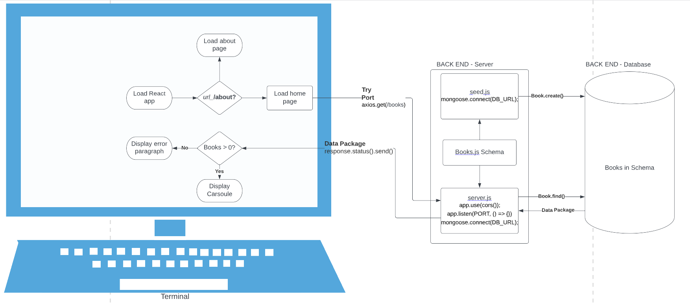

# Can of Books

**Author**: (alphabetically) Aaron Imbrock and Cisco Sanchez
**Version**: 1.9

## Check It Out

[Can Of Books](https://can-of-books99.netlify.app/)

## Overview

The CAN-OF-BOOKS-BACKEND project implements the REST API for [can-of-books-frontend](https://github.com/aaron-imbrock/can-of-books-frontend). It's built with Node.js, Express, and integrated with MongoDB for data storage needs.

Can of Books Backend provides an API for the managed list of books we've read, and intend to read in the near future.

## To build this yourself

### MongoDB Atlas

Create a cluster on [MongoDB Atlas](https://www.mongodb.com/atlas). When creating a cluster, the option "Shared" is free, and adequate for our needs.

### Clone this Repo

```bash
git clone git@github.com:aaron-imbrock/can-of-books-backend.git
cd can-of-books-backend
cp .env.sample .env
```

### Update dotenv

Update the `DB_URL` in the `.env` file with the link to your DB on MongoDB Atlas.

### NPM install and run

```bash
cd can-of-books-backend
npm install
```

### Seed your database

Review `seed.js` and update as you wish. We will use this to seed data to the database.
From the command line run:

```bash
$ node seed.js
Book1 was created...
Book2 was created...
Book3 was created...
```

## Architecture

The production backend is hosted on Render.com - https://can-of-books-backend-drf3.onrender.com
The front-end is currently written in React while the backend uses Node.js and Express, with data storage provided by MongoDB.

https://can-of-books-backend-drf3.onrender.com/books


## Estimates

```bash
Name of feature: Set up repositories, logins, and Mongo Atlas.
Estimate of time needed to complete: 1 hour
Start time: 2pm
Finish time: 3pm
```

```bash
Name of feature: view the list of books on front-end
Estimate of time needed to complete: 2 1/2 hours
Start time: 3pm
Finish time: 6pm
```

```bash
Name of feature: 
Estimate of time needed to complete: 
Start time: 
Finish time: 
```

## Credit and Collaborations

- Cisco Sanchez [GITHUB](https://github.com/c0d3cisco)
- Aaron Imbrock [GITHUB](https://github.com/aaron-imbrock)
